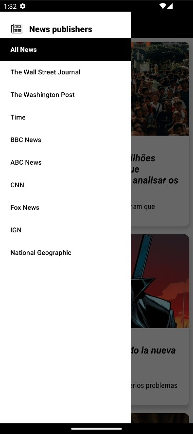

# News Recap

## Overview
NewsRecap is a simple Android application that fetches and displays news articles from NewsAPI. The app allows users to browse news headlines, view full articles, and filter news by specific publishers using a side navigation drawer.

## Features
- Fetches news articles from a remote API
- Caches data for offline access (Offline First approach)
- Displays news headlines with images
- Supports filtering news by publisher
- Allows users to open a full-screen news article view
- Pull-to-refresh functionality

## Technologies & Patterns Used
- MVVM (Model-View-ViewModel) architecture
- Room for local database and caching
- Retrofit for network requests
- Dependency Injection (Hilt)
- Glide for image loading
- SwipeRefreshLayout for pull-to-refresh functionality
- Offline First caching strategy
- Navigation Drawer for selecting news sources
- UI built with XML layouts

## How to Run the Project
1. Clone the repository:
```
git clone https://github.com/DmytroDyshuk/NewsRecap.git
cd NewsRecap
```
2. Open the project in Android Studio
3. Add your NewsAPI key to local.properties:
```
3. NEWS_API_KEY=your_api_key_here
```
4. Sync and build the project
5. Run the app on an emulator or physical device

## Why This Project?
This project is a practice exercise to improve my skills in:
- Android architecture patterns (MVVM, Repository pattern)
- Working with REST APIs using Retrofit
- Efficient data caching with Room
- Dependency Injection using Hilt
- UI development with XML

## Screenshots


